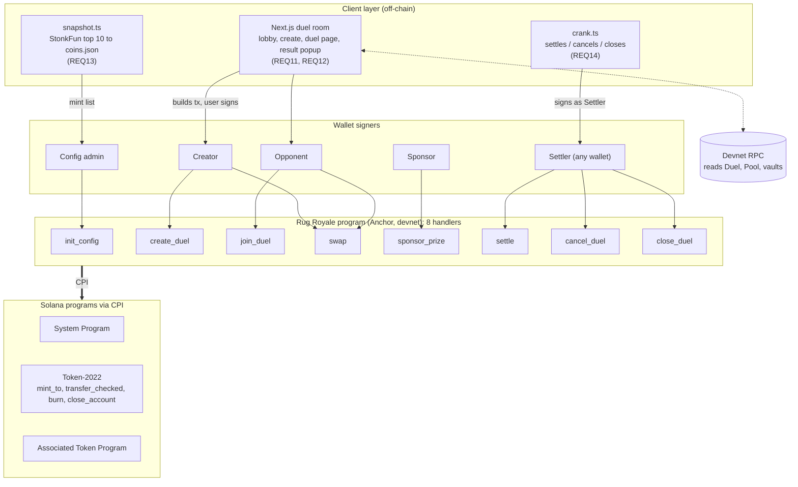
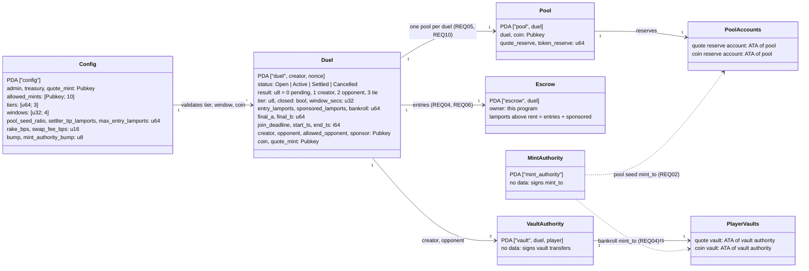
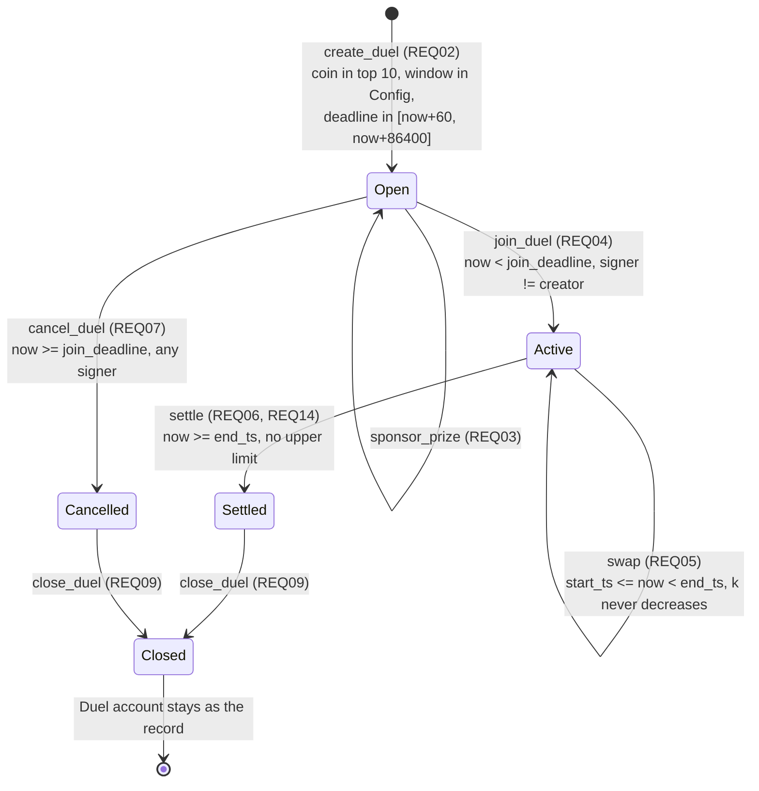
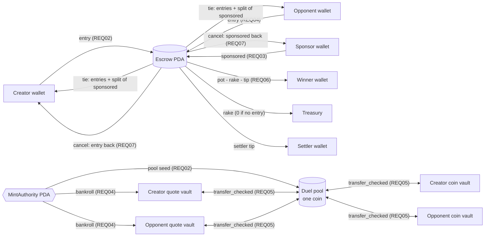
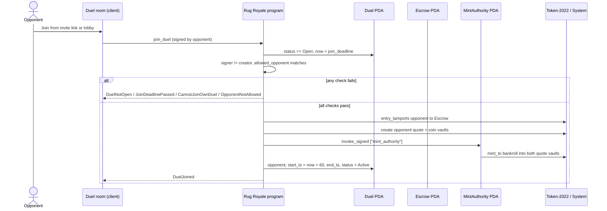
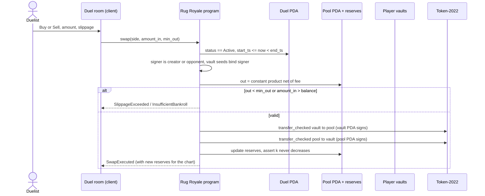
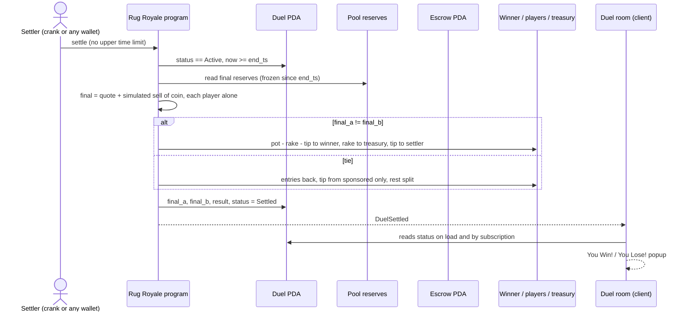

# Rug Royale

**1v1 trading duels on Solana. Same coin, same pool, one survivor.**

Two players each escrow an entry, receive identical demo-token bankrolls, and trade the same coin in one shared constant-product pool for a fixed window. When the window closes, the program values both positions on-chain and pays the pot, minus rake, to the higher final value. Coins come from a snapshot of the StonkFun top 10.

Turbin3 capstone by Justin ([@0xSardius](https://github.com/0xSardius)) and Yamin Raad ([@Raad05](https://github.com/Raad05)), with Sidharth contributing to the design phase.

| | |
| --- | --- |
| **Devnet program ID** | [`5USpVpECZNcq4ZjRUyATb9ykcSRzZ29vHDwNMYFwNJWE`](https://explorer.solana.com/address/5USpVpECZNcq4ZjRUyATb9ykcSRzZ29vHDwNMYFwNJWE?cluster=devnet) |
| **Framework** | Anchor 1.1.2, Token-2022 via `token_interface` |
| **Frontend** | Next.js 16 (`app/`), _Vercel link: TBD_ |
| **Specs** | [PRD](docs/prd.md) (source of truth), [architecture PDF](docs/architecture.pdf), [LOI](docs/loi.pdf) |

## Devnet tests

> _Screenshot of the passing devnet test suite goes here (Turbin3 requirement). Added once the suite is green._

## How a duel works

A duel holds three separate assets. Only the entry is the player's own money.

| Asset | On devnet | Created by | What it decides |
| --- | --- | --- | --- |
| **Entry** | Devnet SOL, held in the duel's `Escrow` | The players | Who gets paid: the winner receives the pot minus rake |
| **Bankroll** | Demo quote token (devSTONK), equal for both players | `MintAuthority` PDA at `join_duel` | Who won: each player's final value is measured in it |
| **Coin** | Demo mint standing in for one StonkFun top-10 coin | `MintAuthority` PDA seeds the pool at `create_duel` | What both players trade |

1. **Create.** The creator picks a coin, bankroll tier, window, and entry, and escrows the entry. The program creates the duel, its escrow, its pool (seeded at a 1:1 price), and the creator's vaults.
2. **Join.** An opponent escrows the same entry. Both players get the same bankroll, and the trading window starts 60 seconds later.
3. **Trade.** Each player buys and sells the coin against the shared pool. Every trade moves the price the other player sees.
4. **Settle.** After the window, anyone can call `settle` (in practice a crank bot or either player). Each position is valued as quote balance plus a simulated sell of the coin balance against the final reserves. The higher value wins the pot minus rake. A tie returns both entries.
5. **Close.** Anyone can close a finished duel. Leftover tokens are burned, token accounts are closed, and rent goes back to whoever paid it. The `Duel` account stays as the permanent record.

## Architecture

### System context



Price comes **only** from the duel pool's reserves (REQ10). No oracle, keeper, or off-chain price signer can move it. The real StonkFun price is shown in the client for context and never enters settlement.

### Account model



Design notes:
- **`Escrow` is program-owned** (PRD G1), not a System account as the architecture PDF's diagram 6.2 shows. Payouts debit its lamports directly, and `close_duel` closes it back to the creator.
- **`Duel` has a fixed layout** with no `Option` fields (G9). Unset pubkeys are `Pubkey::default()`. That keeps byte offsets stable for the lobby's `getProgramAccounts` filters: `status` at byte 8, `creator` at 89, `opponent` at 121.
- **No human holds a mint authority.** The 11 demo mints were created with their mint authority set to the `MintAuthority` PDA (G11).

### Duel lifecycle



`join_duel` requires `now < join_deadline` and `cancel_duel` requires `now >= join_deadline`, so exactly one is valid at any moment. `settle` never expires and nothing else can move a duel out of `Active`, so a late settle always produces the same result.

### Fund and token flows



On a tie, entries go back in full, the settler tip comes only from the sponsored amount, and the rest of the sponsored amount is split between the two players, with an odd lamport going to the creator. The sponsor is refunded only when a duel is cancelled (PRD G15).

### Core use cases

<details>
<summary><b>UC-1 <code>join_duel</code></b>: Open to Active</summary>


</details>

<details>
<summary><b>UC-2 <code>swap</code></b>: one trade in the shared pool</summary>


</details>

<details>
<summary><b>UC-3 <code>settle</code></b>: Active to Settled, pays out</summary>


</details>

### Payout math

All program math rounds down with u128 intermediates. `packages/sdk/src/math.ts` mirrors it exactly, and both sides are checked against shared test vectors.

```
Swap (fee stays in pool)   in_net = amount_in * (10_000 - fee_bps) / 10_000
  Buy:  out = token_reserve * in_net / (quote_reserve + in_net)
  Sell: out = quote_reserve * in_net / (token_reserve + in_net)

Valuation at settle         final = quote_vault + sell_out(coin_vault, end reserves)

Payout                      pot = 2 * entry + sponsored
  Winner: rake = entry == 0 ? 0 : pot * rake_bps / 10_000
          tip  = min(settler_tip, pot - rake);  prize = pot - rake - tip
  Tie:    entries back; tip = min(settler_tip, sponsored); rest split, odd lamport to creator
```

## Repository layout

```
programs/rug_royale/   Anchor program: 8 handlers, state, math, errors, events
  tests/vectors/       math test vectors shared by the Rust and TS math
packages/sdk/          @rug-royale/sdk: PDAs, account maps, decoders, filters, math, coins
tests/                 LiteSVM suites + shared fixtures (tests/devnet/: devnet suite)
scripts/               snapshot, setup-mints, init-config, crank, checkpoint
app/                   Next.js frontend
idl/                   frozen IDL and TS types
coins.json             StonkFun top 10 and their devnet demo mints
docs/                  PRD, architecture, LOI, Turbin3 brief, build plan, progress
```

## Running it

Prerequisites: Rust (pinned by `rust-toolchain.toml`), Solana CLI, Anchor 1.1.2 (`avm use 1.1.2`), Node 24, and pnpm 10.

```bash
pnpm install
anchor build            # program, IDL, TS types
pnpm test               # anchor build + LiteSVM suites
pnpm test:devnet        # full duels against the deployed devnet program (~3 min; set RPC_URL to avoid public-RPC rate limits)
pnpm test:rust          # Rust unit tests (math, layout)
pnpm --filter @rug-royale/app dev   # frontend at localhost:3000
```

Devnet setup, in order (each script reads `.env`; see `.env.example`):

```bash
pnpm snapshot           # StonkFun top 10 -> coins.json
pnpm setup-mints        # create the 11 demo mints (authority = MintAuthority PDA)
pnpm init-config        # dry run: prints Config and simulates
pnpm init-config --send # initialize Config (permanent), then diff it on-chain
pnpm crank              # settle / cancel / close duels every 5 s (--once for one pass)
```

## Known limits (accepted for the MVP)

| Limit | Roadmap fix |
| --- | --- |
| **Opening race:** in a constant-product pool the first buyer gets a better price, so if both players buy and hold, the first buyer wins | Opening batch auction where both opening buys fill at one price |
| **Closed two-player market:** PnL comes only from the opponent's trades | Real Raydium CPMM pools on mainnet |
| **Sponsor self-dealing:** a creator can invite their own second wallet and collect a sponsored prize | Sponsor approves the opponent; collusion signals |
| **No refund once Active:** a `settle` bug needs a program upgrade | Two-party-signed refund on mainnet |
| **Fixed coin list:** no `update_config` | Admin `update_config` behind a multisig |
| **Lobby uses `getProgramAccounts`**, which doesn't scale | Indexer (Helius webhooks) |

## Compute units

> _Measured `create_duel` and `join_duel` CU numbers go here once the handlers are complete (PRD §9 scenario 7). The account initializations alone use about 140k CU, so clients send a 400k compute-unit limit._
